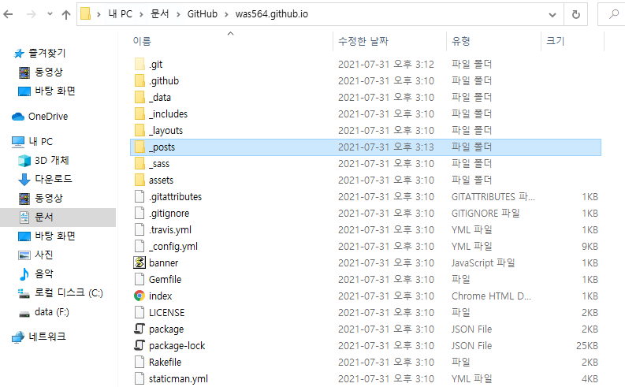
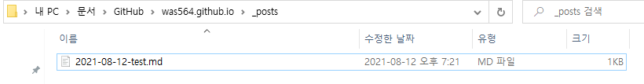
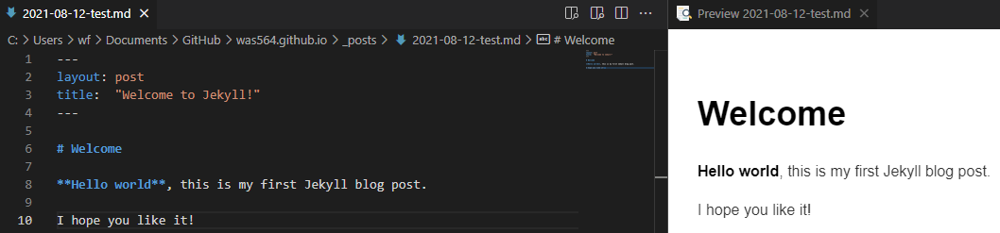
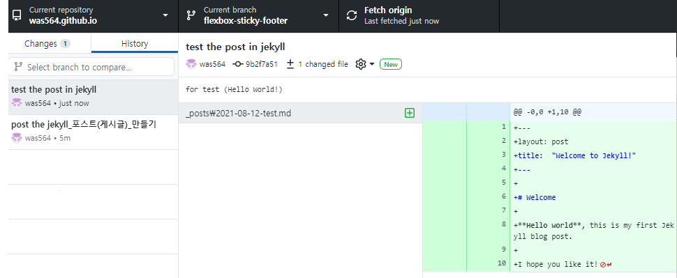
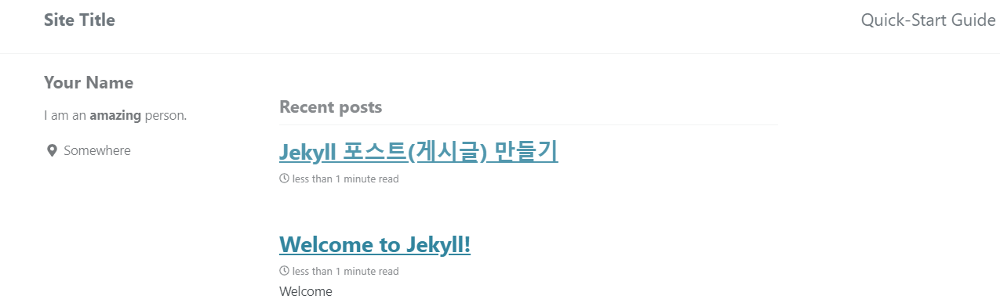
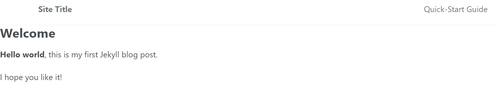

# Jekyll 포스트(게시글) 만들기

----------
## 1. _posts 디렉토리(폴더) 만들기

해당 사진과 같이 jekyll 블로그를 받아온 repository에 _posts 이름의 폴더를 생성해주세요.

## 2. 포스트할 md(마크다운)파일 만들기(혹은 업로드)

위 사진처럼 포스트할 마크다운 파일을 만들고

자기가 원하는 내용을 적은 후 저장을 해주세요.

## 3. github repository에 넣기

git shell이나 github Desktop을 통해 파일을 리파지토리에 동기화 시켜주세요.

## 결과

자기 블로그에 들어가면 이런 posts들이 생기고 

위 사진처럼 잘 적용되는 것을 볼 수 있습니다.

### 참고한 사이트
마크다운 작성  
https://gist.github.com/ihoneymon/652be052a0727ad59601

마크다운 이미지 첨부  
https://blog.naver.com/PostView.naver?isHttpsRedirect=true&blogId=chandong83&logNo=220812226888

포스팅 튜토리얼  
https://jekyllrb-ko.github.io/docs/posts/