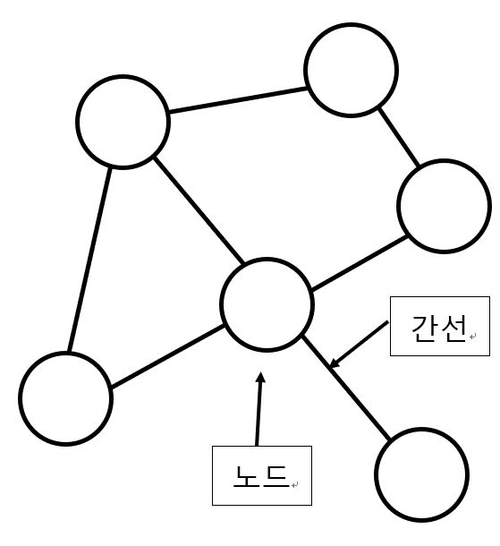
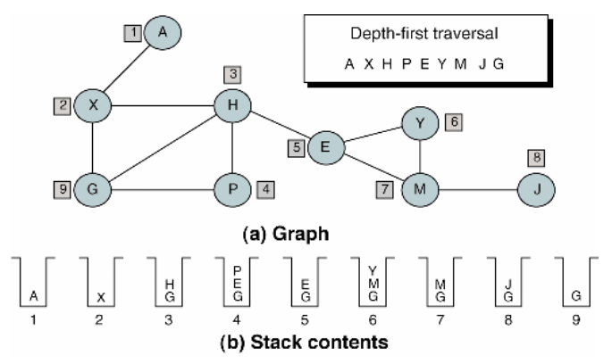
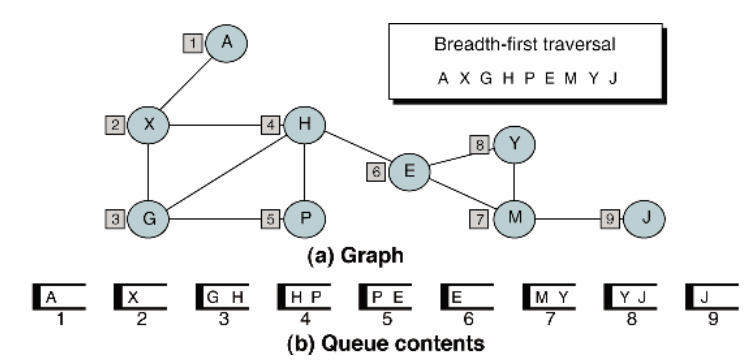

# BFS, DFS, 재귀함수 (feat. 백준 1697)

----------
## 1. 그래프
- 여러 노드와 간선으로 이루어진 네트워크나 자료구조
  


그래프가 주로 쓰이는 유형은 (개인 경험 상) 
- (점화식같은) 수 많은 경우의 수 중에서 일부인 경우를 찾아야 하는 경우  
- 노드와 노드 사이의 관계(간선의 정보)를 이용하여 푸는 경우  

이렇게 2가지라고 생각한다.  

그래프는 종류에 따라 여러 그래프가 있는데 그 이론은 다른 포스트에서 설명할게요.  

## 2. DFS

깊이 우선 탐색 (DFS - Depth First Search)


그림과 같이 한 분기를 전부 탐색하고 다른 분기로 넘어가면서 탐색하는 알고리즘이다.  



DFS는 스택이나 재귀함수로 알고리즘을 구현 할 수 있다.  

다른 사이트에서 공부하며 찾아본 바로는 모든 노드를 찾는게 BFS보다 빠르다고 한다.  

## 3. BFS

너비 우선 탐색 (BFS - Breadth First Search)


bfs도 그림과 같이 루트 노드에서 가까운 노드부터 탐색하는 알고리즘이다.



BFS는 큐로 알고리즘을 구현할 수 있다.  

이번 백준 1639번 문제같이 제일 짧은 거리(최단거리)와 관련된 문제들은 bfs로 풀면 웬만해서는 풀린다.  

다만 조건으로는 모든 노드의 간선치(간선을 지날 때 생기는 비용으로 생각하면 된다)가 동일해야 한다.  
다르면 다익스트라 알고리즘을 쓴다. (물론 이것도 간선치가 양수일 때만 가능하다) 

다익스트라 알고리즘도 다른 포스트에서 설명할게요.  

## 재귀함수에 대한 생각

이 포스트에서 재귀함수가 쓰이는 경우는 BFS이다.  

처음에 백준 1697 숨바꼭질 문제를 이 BFS 재귀함수로 그래프를 구축 후 최종 값을 찾는 방법을 선택했는데 복잡도가 크고 꼬리 재귀함수식으로 안 만들고 계속 스택으로 쌓인 결과 스택 오버플로가 떠버렸다.  
그 이후 bfs dfs를 찾으며 해결법은 찾았지만 재귀함수에 대해 한번 더 생각하게 되었다.  

그래서 개인적으로 생각하는 재귀함수 룰은  
- 재귀함수를 만들 때는 꼬리 재귀함수로 만들자  
- 꼬리 재귀함수가 안되면 자료구조를 이용하여 풀어보자  
- 점화식에 관한 재귀라면 쓰기 전에 수렴하는지 확인하자  
(위 사항은 미적분학에서 수렴 판정법을 알아보자)  

## 여담

그래프와 관련된 문제는  
- 모든 경우의 수에 대한 그래프를 만들고 탐색하여 푸는 경우  
- 그래프를 전부 만들지 않고 필요한 부분만큼까지만 경우의 수를 탐색하면서 찾고 푸는 경우  
2가지 경우가 있는데  
아마도 PS(한번만 돌리는 프로그램)에서는 후자가 좋지만 이 알고리즘을 여러번 쓸 때는 전자가 좋다고 생각한다.  

-------------

### 백준 문제 제출 코드

첫번째 제출  
재귀함수 bfs를 이용하여 그래프를 구축하고 최종 값 구하기  
문제점 : 복잡도가 O(N*N)이여서 스택오버플로가 뜨고 프로그램이 터져버린다.  
``` c++
#include <iostream>
#include <vector>

using namespace std;

void extractResult(vector<int>& results, int itsValue, int goal, bool isRight);

int main() {
	int N, K;
	
	cin >> N >> K;

	vector<int> results;
	bool isRight;
	results.resize(100001, -1);

	results[N] = 0;
	if (N < K) isRight = true;
	else isRight = false;
	extractResult(results, N, K, isRight);

	cout << results[K];

	return 0;
}

void extractResult(vector<int>& results, int itsValue, int goal, bool isRight) {
	if (itsValue == goal) return;
	if (results[itsValue] == -1) return;
	
	if (goal > itsValue && itsValue != 0) {
		if (itsValue * 2 > 100000 || itsValue * 2 < 0);
		else if (results[itsValue * 2] == -1) {
			results[itsValue * 2] = results[itsValue] + 1;
			extractResult(results, itsValue * 2, goal, isRight);
		}
		else if (results[itsValue * 2] > results[itsValue] + 1) {
			results[itsValue * 2] = results[itsValue] + 1;
			extractResult(results, itsValue * 2, goal, isRight);
		}
	}

	for (int x = 1; x == 1 || x == -1; x -= 2) {
		if (!((itsValue > goal)^isRight) && !((x > 0) ^ isRight)) continue;
		else if (itsValue + x > 100000 || itsValue + x < 0) continue;
		else if (results[itsValue + x] == -1) {
			results[itsValue + x] = results[itsValue] + 1;
			extractResult(results, itsValue + x, goal, isRight);
			return;
		}
		else if (results[itsValue + x] > results[itsValue] + 1) {
			results[itsValue + x] = results[itsValue] + 1;
			extractResult(results, itsValue + x, goal, isRight);
			return;
		}
	}
	
}
```

-------------

### 참고사이트

https://velog.io/@wkdgus7113/%EA%B7%B8%EB%9E%98%ED%94%84%EC%99%80-DFS-BFS-%EC%A0%95%EB%A6%AC

https://devuna.tistory.com/32

https://www.zerocho.com/category/Algorithm/post/5870153c37e1c80018b64eb0
