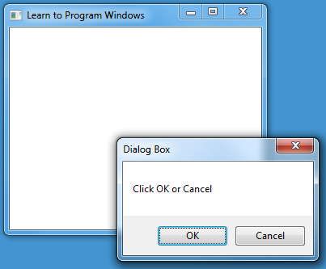

# win32(Windows.h) Study

win32 api는 간단하게 윈도우 창을 띄우는 api이다  
이걸 간단하게 사용할 수 있도록 윈도우에서 MFC라는 프레임워크를 제공한다  


아래 코드는 마이크로소프트에서 제공하는 샘플 코드이다.
``` c++
#ifndef UNICODE
#define UNICODE
#endif 

#include <windows.h>

LRESULT CALLBACK WindowProc(HWND hwnd, UINT uMsg, WPARAM wParam, LPARAM lParam);

int WINAPI wWinMain(HINSTANCE hInstance, HINSTANCE hPrevInstance, PWSTR pCmdLine, int nCmdShow)
{
    // Register the window class.
    const wchar_t CLASS_NAME[]  = L"Sample Window Class";
    
    WNDCLASS wc = { };

    wc.lpfnWndProc   = WindowProc;
    wc.hInstance     = hInstance;
    wc.lpszClassName = CLASS_NAME;

    RegisterClass(&wc);

    // Create the window.

    HWND hwnd = CreateWindowEx(
        0,                              // Optional window styles.
        CLASS_NAME,                     // Window class
        L"Learn to Program Windows",    // Window text
        WS_OVERLAPPEDWINDOW,            // Window style

        // Size and position
        CW_USEDEFAULT, CW_USEDEFAULT, CW_USEDEFAULT, CW_USEDEFAULT,

        NULL,       // Parent window    
        NULL,       // Menu
        hInstance,  // Instance handle
        NULL        // Additional application data
        );

    if (hwnd == NULL)
    {
        return 0;
    }

    ShowWindow(hwnd, nCmdShow);

    // Run the message loop.

    MSG msg = { };
    while (GetMessage(&msg, NULL, 0, 0) > 0)
    {
        TranslateMessage(&msg);
        DispatchMessage(&msg);
    }

    return 0;
}

LRESULT CALLBACK WindowProc(HWND hwnd, UINT uMsg, WPARAM wParam, LPARAM lParam)
{
    switch (uMsg)
    {
    case WM_DESTROY:
        PostQuitMessage(0);
        return 0;

    case WM_PAINT:
        {
            PAINTSTRUCT ps;
            HDC hdc = BeginPaint(hwnd, &ps);

            // All painting occurs here, between BeginPaint and EndPaint.

            FillRect(hdc, &ps.rcPaint, (HBRUSH) (COLOR_WINDOW+1));

            EndPaint(hwnd, &ps);
        }
        return 0;

    }
    return DefWindowProc(hwnd, uMsg, wParam, lParam);
}
```
여기서 만약 Visual Studio에서 빈 프로젝트로 실행할 경우 main 진입점을 찾지 못하며 LNK2019 에러를 낸다.  
이럴 때 <B>프로젝트 속성 >> 링커 >> 시스템 >> 하위 시스템</B>을 콘솔에서 창으로 변경하면 정상적으로 실행이 된다.  

-----

### Windows 코딩 규칙

Windows 헤더에는 typedef가 여러 개 있으며 이 타입들의 대부분은 WinDef.h에 정의되어 있다.

#### 정수 형식

|타입 이름|크기|부호 여부|
|:------:|:--:|:------:|
|BYTE|8비트|X|
|DWORD|32비트|X|
|WORD|16비트|X|
|INT32|32비트|O|
|INT64|64비트|O|
|LONG|32비트|O|
|LONGLONG|64비트|O|
|UINT32|32비트|X|
|UINT64|64비트|X|
|ULONG|32비트|X|
|ULONGLONG|64비트|X|

#### 부울 형식
BOOL 타입은 int 형식의 별칭(다른 이름)이다.
일반적으로 FALSE와 TRUE는 아래와 같이 정의한다.
``` cpp
#define FALSE   0
#define TRUE    1
```
몇몇 함수는 TRUE를 반환할 때 1이 아닌 다른 값을 반환할 수 있으므로 검증할 때 아래와 같이 해야 한다.
(이 내용은 해당 BOOL 타입 뿐만 아니라 0 혹은 0이 아닌 값으로 판별하는 타입에도 적용되는 내용인 것 같다.)
```cpp
// right way
if (returnBoolean()) {...}
if (returnBoolean() != FALSE) {...}

// wrong way
if(returnBoolean() == TRUE) {...}
```

#### 포인터 정밀도 형식
포인터는 아래와 같이 사용할 수 있다.

- DWORD_PTR
- INT_PTR
- LONG_PTR
- ULONG_PTR
- UINT_PTR

#### 포인터 형식 (참고 사항)
Window는 pointer-to-X 형식의 많은 데이터 형식이 있으며 일반적으로는 P- LP- 같은 접두사가 있다고 한다.
이게 있던 이유는 어셈블러 쪽이나 실제 메모리쪽에서 포인터를 실제 메모리 위치에 따라 구분할 필요가 있었기 때문이다.
윈도우에서는 16비트 코드를 32비트 Windows로 보다 쉽게 포팅할 수 있도록 하기위해서 존재했지만 현재는 쓰지 않는다고 한다.
이에 대한 해답은 아래에 나와있습니다.
https://stackoverflow.com/questions/2315311/what-is-a-long-pointer

### 문자열을 사용한 작업
Windows는 기본적으로 유니코드 문자열을 지원하며
16비트 값 한 개 또는 두 개로 이루어진 UTF-16 인코딩을 사용하여 유니코드 문자를 나타낸다.
UTF-16 문자는 8비트 ANSI 문자와의 구별을 위해 와이드 문자라고도 불린다.

그리고 Visual C++(윈도우에만 있는 라이브러리라고 생각하면 편하다.)에서는
아래 코드와 같이 정의 되어 있으며 와이드 문자 혹은 문자열 리터럴을 선언하기 위해 리터럴 앞에 L을 놓는다.
``` cpp
typedef wchar_t WCHAR;

whcar_t a = L'a';
WCHAR *str = L"hello";
```

참고로 상수(const)는 변수가 가리키고 있는 주소의 값이 변하지 않음을 의미하고
리터럴(Literal)은 데이터의 값이 변하지 않음을 의미한다.
자세한 내용은 https://mommoo.tistory.com/14 참고 바랍니다.

### 유니코드 및 ANSI 함수
Windows는 ANSI 문자열과 유니코드 문자열을 병렬 API 집합을 제공한다.
따라서 두 문자열 간에 전환을 아래 함수를 이용하여 사용할 수 있다.

- SetWindowTextA : ANSI 문자열 사용
- SetWindowTextW : 유니코드 문자열 사용
  
해당 프로젝트나 실행 환경에 따라 유동적으로 변할 수 있도록 아래 코드처럼 매코드로 정의할 수도 있다.
``` cpp
#ifdef UNICODE
#define SetWindowText   SetWindowTextW
#else
#define SetWindowText   SetWindowTextA
#endif
```
마이크로소프트에서는 새 애플리케이션은 항상 유니코드 버전을 호출해야 한다고 한다.
이유는 2가지가 있으며 아래와 같다.
1. ANSI 문자열을 사용하는 경우 애플리케이션을 지역화할 수 없다.
2. ANSI 버전은 운영 체제가 런타임에 ANSI 문자열을 유니코드로 변환해야 하므로 효율성이 떨어진다.
(아마도 이 부분은 대부분의 OS에서 ANSI가 아닌 유니코드를 기반으로 문자열이 형성되어 있기 때문이라고 추정한다.)

### TCHAR
프로그램이 Windows NT, 95, 98, Me 등 예전 운영체제를 모두 지원해야 할 때
ANSI, 유니코드를 대체하는 또다른 문자 형식을 사용하는 것으로 보인다.

-----

### 창(Window)이란
창은 보통 애플리케이션(응용 프로그램)을 실행 시키면 나오는 프레임 혹은 그 구성 요소를 말한다.
창의 종류는 크게 2가지로 나눌 수 있다.
1. 일반적인 프레임인 애플리케이션 창 혹은 주 창
2. 버튼 및 편집 상자와 같은 UI 컨트롤 등

마이크로소프트는 창을 4가지 구성요소로 생각을 하였다고 한다.
1. 화면의 특정 부분을 차지한다.
2. 특정 시점에 표시될 수도, 표시되지 않을 수도 있다.
3. 자신을 그리는 방법을 알고 있다.
4. 사용자 또는 운영 체제의 이벤트에 응답한다.

### 부모 창 및 소유자 창
창은 관계에 따라 부모 자식 관계 혹은 소유자 관계를 가질 수 있다.
아래 그림은 애플리케이션 창과 대화 상자 창을 표시한 것이다.


먼저 부모 창은 위 사진에서 
- 대화 상자 창의 OK 및 Cancle 버튼이 해당 창의 위치나 크기 등을 존속하므로 부모 관계이다.
OK 및 Cancle 버튼이 자식 창이고 대화 상자 창이 부모 창이다.
- 그리고 애플리케이션 창의 최소화, 종료 버튼 등이 해당 창에 존속되므로 부모 관계이다.
최소화, 종료 버튼이 자식 창이고 애플리케이션 창이 부모 창이다.

그리고 소유자 창은
- 해당 애플리케이션 창에서 이벤트나 내부 함수로 대화 상자 창을 띄우거나
대화 상자의 사용자 혹은 운영체제에 의해 조작되고 해당 값을 애플리케이션 창에 보내주므로
애플리케이션 창은 대화 상자 창의 소유자 관계이다.

해당 관계를 그림으로 나타내면 아래와 같다.


### 창 핸들


### Reference
https://learn.microsoft.com/ko-kr/windows/win32/learnwin32/learn-to-program-for-windows
https://stackoverflow.com/questions/2315311/what-is-a-long-pointer
https://mommoo.tistory.com/14